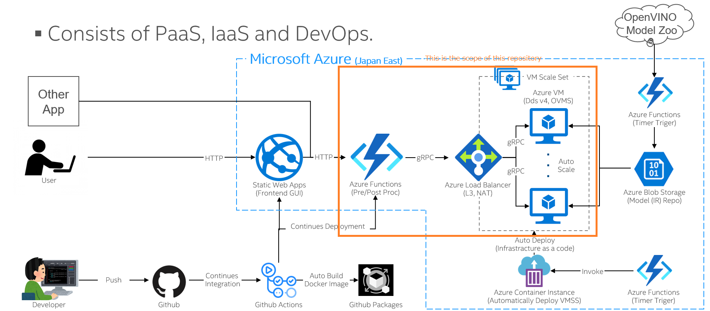
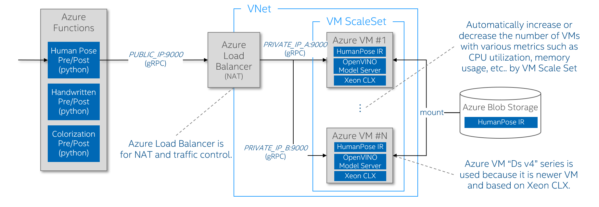

# OVaaS Backend Development
This is a OVaaS's backend source code. Please follow the instrunctions described below and try to have your custom backend application.

By the way, the backend of OVaaS consists of Azure Functions and Azure VM ScaleSet. And other than them, various technologies, softwares and services are included. You need to understand the overview of them as a first step.


## 0. Prerequisites
- Windows 10 / Linux / macOS
- Python 3.7+
- [Visual Studio Code](https://azure.microsoft.com/ja-jp/products/visual-studio-code/)
- [Docker](https://docs.docker.com/get-docker/)
- [Node.js](https://nodejs.org/ja/download/) (to use npm)
- [Azure Storage Explorer](https://azure.microsoft.com/ja-jp/features/storage-explorer/)
- [Azure Functions Core Tools (v3.x)](https://docs.microsoft.com/ja-jp/azure/azure-functions/functions-run-local?tabs=windows%2Ccsharp%2Cbash#install-the-azure-functions-core-tools)
## 1. Setup Development Environment

### Install softwares described as prerequisites
Recommend to install latest version of each software. All softwares can be installed easily with GUI-based install wizard.
### Install VSCode Extensions
- Launch VSCode
- Go to the Extention pane
- Search and install the extentions below
    - Azure Functions
    - REST Client
### Clone this repository and open it with VSCode
- Launch command prompt and change directory as you want.
- Clone this repository there by the command below
    ```cmd
    git clone https://github.com/OVaaS/ovaas-backend.git
    ```
- Launch VSCode to load the repository by the command below
    ```cmd
    cd ovaas-backend
    code .
    ```
### Create Python venv on VSCode
VSCode shows a dialog to ask you if venv can be automatically created so it will be easy to create it by clicking "Yes" button there. But you can create it by yourselves using the instructions below if it is not shown.

- Launch command prompt in VSCode
- Create venv by the command below
    This command will create a venv named ".venv" 
    ```cmd
    python -m venv .venv
    ```
After creating the venv, you need to choose a python interpreter to run an application on VSCode.
- Choose Python interpreter

    Open the "Command Palette" from the "View" item on the menu bar and type "Python: Select Interpreter", then you can choose a python interpreter from the list shown there. Recommend to choose the one in the venv you just created.
- Install required libraries
    ```cmd
    python -m pip install --upgrade pip
    pip install -r requirements.txt
	pip install azure-storage-blob
    ```

### Launch a local Azure Storage as a Docker container
Now you are ready to launch some docker containers for developping. The first one is a local Azure Storage. Do it following the command below.
- Launch a local Azure storage using the Azurite Docker image

    Windows 10
    ```dos
    scripts\LaunchAzurite.bat
    ```
    Linux / macOS
    ```bash
    sh scripts/LaunchAzurite.sh
    ```
    After the command executed, check if local Azure storage is launched by Azure Storage Explorer.

Now you are ready for running a sample application. Follow the next step.
## 2. Run the sample applications
### Launch a local OpenVINO Model server with a pre-trained model
- Look at the list of all pre-trained models by the command below.

    Windows 10
    ```dos
    scripts\GetModelList.bat 1st-parameter

    rem for latest OpenVINO model zoo
    scripts\GetModelList.bat latest
    rem for ver 2021.1 OpenVINO model zoo
    scripts\GetModelList.bat 2021.1
    ```
    Linux / macOS
    ```bash
    scripts/GetModelList.sh 1st-parameter

    # for latest OpenVINO model zoo
    scripts/GetModelList.sh latest
    # for ver 2021.1 OpenVINO model zoo
    scripts/GetModelList.sh 2021.1
    ```
    Here you need one parameter.
    
    - --1st parameter: The version of OpenVINO. Mostly "latest" works fine but sometimes specific model is provided only in specific version of OpenVINO. For example, our "Colorization" model is provided in the version "2021.1". That's why above example shows "2021.1" in command line. 

- Choose one model to download and download it by the command below. For example, current applications use these models.

    Windows 10
    ```dos
    scripts\DownloadModel.bat 1st-parameter 2nd-parameter

    rem For Humanpose
    scripts\DownloadModel.bat human-pose-estimation-0001 latest
    rem For Handwritten
    scripts\DownloadModel.bat handwritten-japanese-recognition-0001 latest
    rem For Colorization
    scripts\DownloadModel.bat colorization-v2 2021.1
    rem For Object Detection
    rem Object detection is original model not in Open Model Zoo.
    ```
    Linux / macOS
    ```bash
    scripts/DownloadModel.sh 1st-parameter 2nd-parameter

    # For Humanpose
    scripts/DownloadModel.sh human-pose-estimation-0001 latest
    # For Handwritten
    scripts/DownloadModel.sh handwritten-japanese-recognition-0001 latest
    # For Colorization
    scripts/DownloadModel.sh colorization-v2 2021.1
    # For Object Detection
    # Object detection is original model not in Open Model Zoo.
    ```
    Here you need two parameters.
    
    - 1st-parameter: The model name
    - 2nd-parameter: The version of OpenVINO. Mostly "latest" works fine but sometimes specific model is provided in only specific version of OpenVINO. For example, our "Colorization" model is provided in the version "2021.1". That's why above example shows "2021.1" in command line.  

- Check if the model is downloaded in local folder. For example, above "human-pose-estimation-0001" should be here.
    ```cmd
    PARENT_DIR/ovaas-backend/models/intel/human-pose-estimation-0001/FPXX
    ```
- Copy the absolute path to the XML file and the BIN file of the pre-trained model and upload the model to the local Azure Storage by the command below.

    Windows
    ```dos
    python scripts\UploadModelFilesToAzureStorage.py --model_name human-pose-estimation --xml_file_path PARENT_DIR\ovaas-backend\models\intel\human-pose-estimation-0001\FPXX\human-pose-estimation-0001.xml --bin_file_path PARENT_DIR\ovaas-backend\models\intel\human-pose-estimation-0001\FPXX\human-pose-estimation-0001.bin
    ```

    Linux / macOS
    ```bash
    python3 scripts/UploadModelFilesToAzureStorage.py --model_name human-pose-estimation --xml_file_path PARENT_DIR/ovaas-backend/models/intel/human-pose-estimation-0001/FPXX/human-pose-estimation-0001.xml --bin_file_path PARENT_DIR/ovaas-backend/models/intel/human-pose-estimation-0001/FPXX/human-pose-estimation-0001.bin
    ```
    Here you need four parameters.
    
    - --model_name: The unique model name
    - --xml_file_path: The absolute path to the XML file of the pre-trained model
    - --bin_file_path: The absolute path to the BIN file of the pre-trained model
    - --connection_string: Optional. The connection string to access the local Azure Storage. You can get this on Azure Storage explorer but probably don't need to specify it. You can edit source code if any other connection string is needed.

- Launch a local OpenVINO model server

    Windows 10
    ```dos
    scripts\LaunchOVMS.bat 1st-parameter 2nd-parameter 3rd-parameter 4th-parameter

    rem Example: Humanpose
    scripts\LaunchOVMS.bat human-pose-estimation 192.168.10.107 9000 latest

    rem Example: Colorization
    scripts\LaunchOVMS.bat colorization 192.168.10.107 9000 2021.1
    ```
    Linux / macOS
    ```bash
    sh scripts/LaunchOVMS.sh 1st-parameter 2nd-parameter 3rd-parameter 4th-parameter

    # Example: Humanpose
    sh scripts/LaunchOVMS.sh human-pose-estimation 192.168.10.107 9000 latest

    # Example: Colorization
    sh scripts/LaunchOVMS.sh colorization 192.168.10.107 9000 2021.1
    ```
    Here you need four parameters.

    - 1st-parameter: The unique model name you just named when to upload the model to the local Azure storage.
    - 2nd-parameter: The IP address assigned to your PC's ethernet adapter. Note: "localhost" and "127.0.0.1" will not work fine.
    - 3rd-parameter: The port number to communicate to a model server.
    - 4th-parameter: The version of OpenVINO. Mostly "latest" works fine but sometimes specific model is provided in only specific version of OpenVINO. Set same version as you download the model in previous step.  

    When you launch all OpenVINO model server, you can use this script.  

    Windows 10
    ```dos
    scripts\ALLLaunchOVMS.bat parameter
    ```
    Linux / macOS
    ```bash
    sh scripts/ALLLaunchOVMS.sh parameter
    ```
    Here you need a parameter.

    - parameter: The IP address assigned to your PC's ethernet adapter. Note: "localhost" and "127.0.0.1" will not work fine.  

    if you add models to "OVaaS-backend", you need to do that model names and model's ports in writting to ALLLaunchOVMS.bat & ALLLaunchOVMS.sh and rewrite the number of models(ports) like below.  

    ALLLaunchOVMS.bat
    ```bat
    for /l %%i in (0,1,8) do (
        ↓
    for /l %%i in (0,1,10) do (
    ```
    ALLLaunchOVMS.sh
    ```bash
    for num in {0..8} ; do
        ↓
    for num in {0..10} ; do
    ```    


### Launch an Azure functions emulater on VSCode
- From the "Run" on the menu bar, click "Start Debugging". Then the emulater should start automatically. You will see the logs like below if it starts successfully.
    ```cmd
    Azure Functions Core Tools
    Core Tools Version:       3.0.3442 Commit hash: 6bfab24b2743f8421475d996402c398d2fe4a9e0  (64-bit)
    Function Runtime Version: 3.0.15417.0


    Functions:

            HttpTriggerHumanPose: [GET,POST] http://localhost:7071/api/HttpTriggerHumanPose

    For detailed output, run func with --verbose flag.
    [2021-05-10T02:00:03.532Z] Worker process started and initialized.
    [2021-05-10T02:00:03.721Z] Host lock lease acquired by instance ID '000000000000000000000000F6FB3AFD'.
    ```
### Run the sample application
- Open the file called "request.http".
- Click the "Send Request" on the top of the pane, then you can see the inference result after a few seconds on the other pane opened like the image below.


## 3. Develop your custom application

### Follow the Step 2 to launch a new OpenVINO model server
You need to launch a new OpenVINO model server with your desired pre-trained model. To do that, follow the step 2 again and have a model server started. Note that you need to use different port number from the one used on human-pose-estiimation model server.

### Create a new Azure Function in the project
- Click the Azure button on the bar on the left of VSCode
- Click the "Create Function" button, then you need to input information below.
    1. Choose "HTTP trigger"
    2. Type an unique function name
    3. Choose "Anounymous" as Authorization Level
- Then you will have a new function template in the same project. 

### Write a new application code following sample code
Basically you can imitate the sample human-pose-estimation's __init__.py.

### Add IP and PORT setting to local.settings.json
If you would like to add new backend aapplication called "AI App", then add new IP address and port number setting into the file "local.settings.json" as below. Actually IP address should be localhost everytime for local development and port number should be different from the numbers already assigned. This example shows 9004 is assigned. 
These variables will be refered in a source code you will made in init.py.
```json
{
  "IsEncrypted": false,
  "Values": {
    "FUNCTIONS_WORKER_RUNTIME": "python",
    "HUMANPOSE_IPADDRESS": "localhost",
    "HUMANPOSE_PORT": "9000",
    "HANDWRITTEN_IPADDRESS": "localhost",
    "HANDWRITTEN_PORT": "9001",
    "COLORIZATION_IPADDRESS": "localhost",
    "COLORIZATION_PORT": "9002",
    "OBJECTDETECTION_IPADDRESS": "localhost",
    "OBJECTDETECTION_PORT": "9003",
    "AIAPP_IPADDRESS": "localhost",
    "AIAPP_PORT": "9004"
  }
}
```
### Launch Azure Function Emulator and test it from request.http
This is same as wht you have done on running the sample above. This would be not difficult. Enjoy anyway!